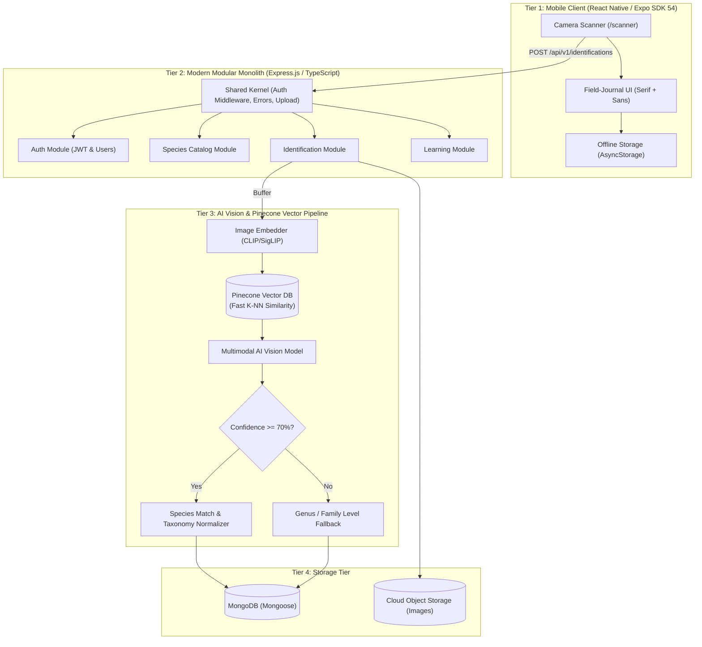

# redBack.ai Modern Development Skill & Runbook

Welcome to the dedicated development skill for **redBack.ai**, an AI-powered spider identification, educational taxonomy, and biodiversity discovery ecosystem.

This runbook establishes strict coding standards, full-stack system architecture, naturalist design system tokens, and domain-specific safeguards for both the mobile client and backend API on branch `mobile`.

---

## 1. System Architecture & Topology

Visual Reference: [`mobile/assets/design/system-design.png`](file:///c:/Users/user/Desktop/redBack.ai/mobile/assets/design/system-design.png)  
Detailed Guide: [`references/system-design.md`](file:///c:/Users/user/Desktop/redBack.ai/.agents/skills/redback-dev/references/system-design.md)



---

## 2. Backend Architecture: Modern Modular Monolith

redBack.ai organizes the backend as a **Modern Modular Monolith** in `backend/src/`:

```text
backend/src/
├── app.ts                         # Express app assembly & global middleware
├── server.ts                      # HTTP listener & process lifecycle
├── config/                        # Core configurations (db.ts, env.ts, pinecone.ts)
├── modules/                       # Domain-driven Bounded Contexts
│   ├── auth/                      # Authentication domain (routes, controller, service, model)
│   ├── species/                   # Species catalog domain (routes, controller, service, model)
│   ├── identification/            # Identification domain (routes, controller, service, pinecone.service, vision-adapter)
│   └── learning/                  # Learning domain (routes, controller, service, model)
└── shared/                        # Shared Kernel
    ├── errors/                    # Centralized AppError & error handler
    ├── middlewares/               # auth.middleware, error.middleware, upload.middleware
    └── utils/                     # Cross-cutting utilities & helpers
```

### AI & Vector Search with Pinecone
- **Pinecone Vector Database** stores dense visual embeddings of spider reference specimens.
- Visual similarity queries execute in sub-50ms with cosine distance and taxonomic metadata filtering.
- Multimodal AI vision models verify morphological features (e.g. eye pattern, abdominal markings) before results are finalized.

---

## 3. Naturalist Field-Journal Design System

Visual Reference: [`mobile/assets/design/ui-components-kit.png`](file:///c:/Users/user/Desktop/redBack.ai/mobile/assets/design/ui-components-kit.png)  
Detailed Guide: [`references/design-system.md`](file:///c:/Users/user/Desktop/redBack.ai/.agents/skills/redback-dev/references/design-system.md)

### Color Tokens ([`mobile/constants/theme.ts`](file:///c:/Users/user/Desktop/redBack.ai/mobile/constants/theme.ts))
| Token | Hex | Role | Usage |
|---|---|---|---|
| `Palette.coral` | `#E04836` | Signature Redback Crimson | Primary CTA buttons, camera shutter, active tab icons |
| `Palette.coralSoft` | `#FDEBE7` | Coral Mist | Venom alert backgrounds, warning badges |
| `Palette.moss` | `#2C4A3E` | Deep Botanical Moss | Secondary cards, learning modules, dark containers |
| `Palette.mossSoft` | `#E6EFEA` | Soft Sage Green | Non-venomous/common species pills, progress bars |
| `Palette.canvas` | `#FBF9F4` | Naturalist Field Paper | Root screen background |
| `Palette.paper` | `#FFFFFF` | Card White | Content cards, modal sheets, floating panels |
| `Palette.ink` | `#17211F` | Deep Charcoal Ink | Primary display headlines, high-contrast text |
| `Palette.muted` | `#6E7773` | Gray-Green Slate | Subtitles, metadata, inactive icons |
| `Palette.line` | `#EAE6DE` | Warm Border Line | Card delimiters, dividers, input borders |
| `Palette.gold` | `#E59824` | Solar Amber | Streak flames, XP counters, quiz awards |
| `Palette.danger` | `#D32F2F` | Medical Alert Red | High toxicity warnings, bite hazard pills |

### Typography Scale
- **Display Headings (H1/H2)**: Editorial Serif (`ui-serif`, `Georgia`, `'Times New Roman'`) for warm naturalist personality (*"Good to see you, Explorer."*, *"Redback spider"*).
- **Body & Controls**: Crisp Modern Sans (`system-ui`, `-apple-system`, `Roboto`) for UI elements, labels, buttons, and form inputs.
- **Scientific Taxa**: Italicized Serif (`ui-serif`), e.g. *Latrodectus hasselti*.

---

## 4. Mobile Development Standards (Expo SDK 54 / Expo Router)

Detailed Screen Map: [`references/screen-map.md`](file:///c:/Users/user/Desktop/redBack.ai/.agents/skills/redback-dev/references/screen-map.md)

1. **Strict File-Based Routing**:
   - Screen files in `mobile/app/` **MUST** be lowercase or kebab-case (e.g., `login.tsx`, `register.tsx`, `settings.tsx`). Never use PascalCase.
   - Dynamic parameters must use bracket notation (e.g. `mobile/app/species/[id].tsx`).
   - Navigation calls must start with a leading slash: `router.push('/(auth)/login')`.
2. **Safe Area & Insets**:
   - Always wrap root screens with `SafeAreaView` from `react-native-safe-area-context` or apply `useSafeAreaInsets()` to prevent clipping under notches and the dynamic island.
3. **Asset Resolution via `@/`**:
   - Always resolve static images and icons via `@/`:
     ```tsx
     <Image source={require('@/assets/images/spider-logo-3d.png')} style={{ width: 48, height: 48 }} />
     ```
4. **Zero Credential Exposure**:
   - Never embed AI vision API keys, Pinecone secrets, database credentials, or token secrets inside the mobile app. All AI and vector requests must proxy through the Express API backend.

---

## 5. Domain Safeguards & Medical Disclaimer

Detailed API Reference: [`references/api-specs.md`](file:///c:/Users/user/Desktop/redBack.ai/.agents/skills/redback-dev/references/api-specs.md)

### Mandatory Safety & Medical Disclaimer
The app identifies potentially lethal species (e.g. *Latrodectus hasselti*, *Atrax robustus*).
- **Rule**: **NEVER** provide self-treatment advice, tourniquet recommendations, or safety guarantees.
- **Requirement**: Every response from `/api/v1/identifications` must include the official disclaimer:
  > *"redBack.ai provides educational species identification assistance only. If bitten by a spider or experiencing severe symptoms, seek immediate emergency medical care."*

### Handling AI Uncertainty
- When vision/vector confidence is `< 70%`, fallback to genus/family level (e.g., *Latrodectus sp.* or *Theridiidae*) and guide the user to retake the photo with better lighting or closer angle.

---

## 6. Development & Verification Runbooks

Troubleshooting Reference: [`references/troubleshooting.md`](file:///c:/Users/user/Desktop/redBack.ai/.agents/skills/redback-dev/references/troubleshooting.md)

### Start Development Environments
- **Local Database**:
  ```bash
  docker compose up -d
  ```
- **Backend API**:
  ```bash
  cd backend && npm run dev
  ```
- **Mobile Client**:
  ```bash
  cd mobile && npx expo start
  ```

---

## 7. Supplementary Reference Index

- [`references/design-system.md`](file:///c:/Users/user/Desktop/redBack.ai/.agents/skills/redback-dev/references/design-system.md): Full component blueprints (Buttons, Cards, Badges, Inputs, Navigation), spacing, and radii.
- [`references/system-design.md`](file:///c:/Users/user/Desktop/redBack.ai/.agents/skills/redback-dev/references/system-design.md): Deep-dive 4-tier full-stack system architecture, Pinecone vector integration, data flows, and safety guardrails.
- [`references/screen-map.md`](file:///c:/Users/user/Desktop/redBack.ai/.agents/skills/redback-dev/references/screen-map.md): 13-screen Expo Router routing table with UI components and design concepts.
- [`references/api-specs.md`](file:///c:/Users/user/Desktop/redBack.ai/.agents/skills/redback-dev/references/api-specs.md): Modular Monolith domain contracts, Pinecone schemas, error format, and disclaimer contracts.
- [`references/troubleshooting.md`](file:///c:/Users/user/Desktop/redBack.ai/.agents/skills/redback-dev/references/troubleshooting.md): Metro resolver fixes, safe area inset handling, and Docker debugging.
