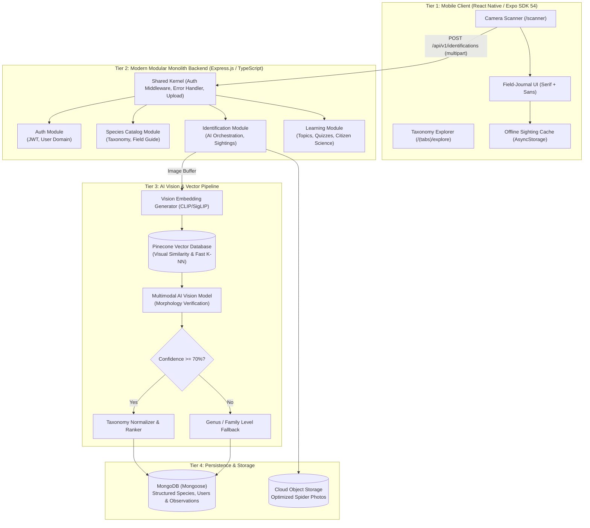

# redBack.ai System Design & Architecture Specification

Welcome to the comprehensive **System Design & Architecture Specification** for redBack.ai. This document details the **Modern Modular Monolith** backend architecture, **Pinecone Vector Database** AI vision pipeline, full-stack data flow, and medical safety guardrails.

---

## 1. System Architecture Diagram



---

## 2. Backend Architecture: Modern Modular Monolith

Rather than a tightly-coupled traditional MVC or overly complex distributed microservices, redBack.ai employs a **Modern Modular Monolith**.

### Core Architecture Principles
1. **Domain-Driven Bounded Contexts**:
   Each feature area lives in an isolated module inside `backend/src/modules/` containing its own:
   - **Routes** (`*.routes.ts`): Express endpoint mappings.
   - **Controller** (`*.controller.ts`): HTTP request parsing, status codes, and input validation.
   - **Service** (`*.service.ts`): Pure domain business logic, independent of Express `req/res`.
   - **Model** (`*.model.ts`): Mongoose schema definitions and typings.
2. **Explicit Dependency Flow**:
   Modules communicate directly through well-defined service contracts or domain events, preventing spaghetti controller dependencies.
3. **Shared Kernel (`backend/src/shared/`)**:
   Cross-cutting infrastructure concerns are encapsulated in `shared/`:
   - `shared/middlewares/`: Authentication JWT verification, rate limiting, and Multer file upload handling.
   - `shared/errors/`: Centralized `AppError` class and global `error.middleware.ts`.
   - `shared/utils/`: Common helpers, formatting, and logging.

### Modules Breakdown
- **`modules/auth`**: User registration, login, JWT issuance, profile updates, and password hashing with bcrypt.
- **`modules/species`**: Curated scientific catalog, taxonomical hierarchy (Order, Family, Genus, Species), search queries, and distribution filters.
- **`modules/identification`**: Multi-stage identification orchestration, Pinecone vector querying, vision model inference, and sighting history.
- **`modules/learning`**: Interactive learning topics, spider anatomy diagrams, quizzes, and citizen science education.

---

## 3. AI & Vector Pipeline: Pinecone Vector Database Integration

redBack.ai uses a high-performance **dual-stage AI identification pipeline** integrating **Pinecone Vector Database** for instant visual similarity search alongside multimodal reasoning models:

```text
[Spider Photo]
      │
      ▼
1. Feature Extraction (Vision Embedder)
   Converts image into a high-dimensional dense embedding vector (e.g. 512/768-dim)
      │
      ▼
2. Pinecone Vector Similarity Search
   K-NN query against indexed reference catalog of arachnid species embeddings
   - Metric: Cosine similarity
   - Metadata filtering: e.g., { "country": "Australia", "family": "Theridiidae" }
   - Top-K: Returns candidate species IDs with vector similarity scores in < 50ms
      │
      ▼
3. Multimodal Vision Verification & Evidence
   Vision model validates visual markers (e.g. red hourglass/stripe, eye arrangement, leg spines)
   and produces structured user-facing evidence
      │
      ▼
4. Confidence Evaluation & Fallback
   - Confidence >= 70%: Confirmed Species match (e.g. Latrodectus hasselti)
   - Confidence < 70%: Fallback to Genus/Family level (e.g. Latrodectus sp.) + photo guidance
      │
      ▼
5. Catalog Enrichment & Venom Safety
   Fetches full scientific taxonomy and attaches mandatory medical disclaimer
```

---

## 4. Venom Safety & Legal Safeguards

Because redBack.ai identifies medically significant species (e.g. *Latrodectus hasselti*, *Atrax robustus*):

1. **Mandatory Disclaimer Contract**: Every identification payload returned by `/api/v1/identifications` must include:
   ```json
   {
     "disclaimer": "redBack.ai provides educational species identification assistance only. If bitten by a spider or experiencing severe symptoms, seek immediate emergency medical care."
   }
   ```
2. **Venom Severity Tiers**:
   - `harmless`: No venom risk to humans (e.g., Garden Orb-weaver).
   - `low`: Mild local irritation (e.g., Huntsman).
   - `moderate`: Painful bite, local swelling, systemic reaction rare.
   - `medically_significant`: Severe neurotoxic or necrotic symptoms requiring medical assessment (e.g., Redback).
   - `severe`: Potentially life-threatening, emergency antivenom indicated (e.g., Sydney Funnel-web).
3. **Medical Advice Prohibition**: The backend must never provide self-treatment, tourniquet recommendations, or delay emergency response.
