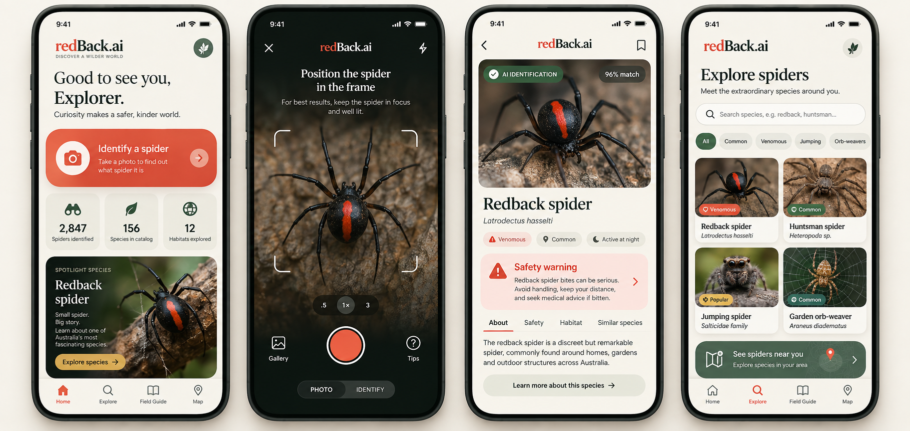
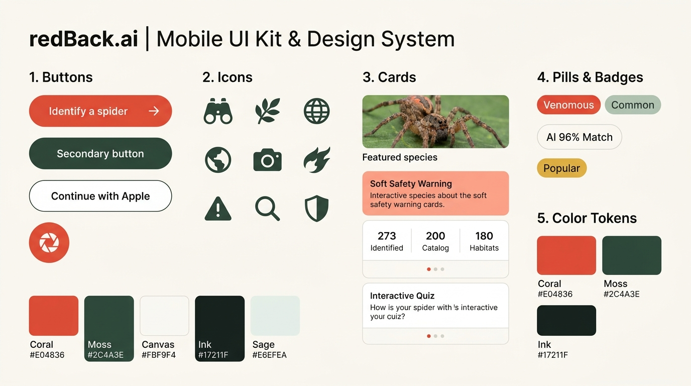
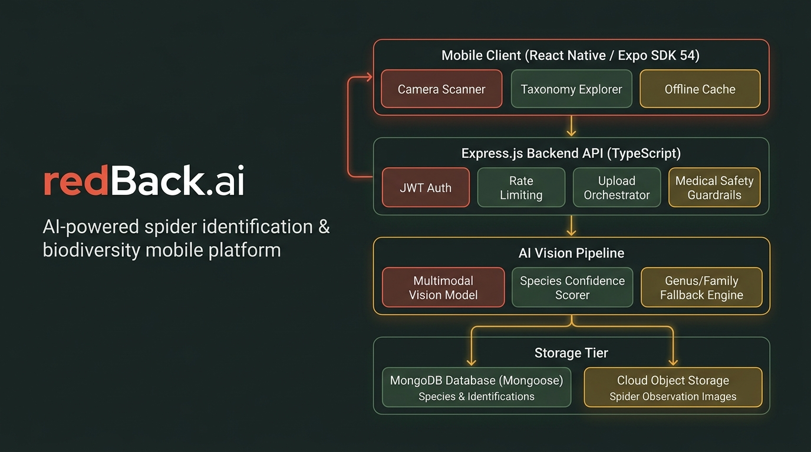

# 🕷️ redBack.ai — AI Spider Explorer & Taxonomy Ecosystem

<div align="center">

[](LICENSE)
[](https://expo.dev)
[](https://reactnative.dev)
[](https://www.typescriptlang.org)
[](https://www.pinecone.io)
[](docs/02-ARCHITECTURE.md)
[](https://www.mongodb.com)

**An open-source, mobile-first AI ecosystem for instant spider species identification, arachnid taxonomy education, and venom safety awareness.**

[Explore Docs](docs/02-ARCHITECTURE.md) • [API Specs](docs/03-API-SPECS.md) • [AI Pipeline](docs/05-AI-VISION-PIPELINE.md) • [Design System](.agents/skills/redback-dev/references/design-system.md) • [llms.txt](llms.txt)

</div>

---

## 📸 Visual Showcase

### Naturalist Mobile UI & Explorer Experience
<div align="center">
  
</div>

<br />

### Mobile UI Kit & Design System
<div align="center">
  
</div>

<br />

### 4-Tier System Architecture Poster
<div align="center">
  
</div>

---

## ✨ Key Features

- **⚡ Dual-Stage AI Vision & Pinecone Vector Search**: Generates dense visual embeddings (CLIP/SigLIP) and queries the **Pinecone Vector Database** for sub-50ms K-NN similarity rankings, verified by multimodal vision models.
- **🔬 Curated Arachnid Taxonomy**: Rich scientific catalog spanning Order, Family, Genus, and Species (*Latrodectus*, *Atrax*, *Missulena*, *Eriophora*, etc.) with distribution maps and behavioral notes.
- **🛡️ Strict Medical & Venom Safeguards**: Enforces mandatory medical disclaimers on every API payload. Never provides DIY bite self-treatment; prioritizes immediate emergency medical advice.
- **🌿 Naturalist Field-Journal Design System**: Warm editorial interface combining classical Serif display typography with modern clean Sans-serif controls and an authentic palette (`#E04836` Coral, `#2C4A3E` Forest Moss, `#FBF9F4` Canvas).
- **📉 AI Uncertainty Fallback (<70%)**: If combined model confidence drops below 70%, the system falls back to Genus or Family level (*Latrodectus sp.*) and prompts for better lighting or angles.
- **📔 Citizen Science Field Notes**: Local offline observation queue and personal sighting history.

---

## 🏛️ System Architecture: Modern Modular Monolith

redBack.ai organizes backend business logic into domain-driven bounded contexts rather than layered MVC:

```text
backend/src/
├── app.ts                         # Express app assembly & global middleware
├── server.ts                      # HTTP listener & process lifecycle
├── config/                        # Core configurations (db.ts, env.ts, pinecone.ts)
├── modules/                       # Domain Modules (Modular Monolith)
│   ├── auth/                      # Authentication domain (routes, controller, service, model)
│   ├── species/                   # Species catalog domain (routes, controller, service, model)
│   ├── identification/            # AI Vision & Pinecone Vector Search domain
│   └── learning/                  # Citizen science education & quizzes domain
└── shared/                        # Shared Kernel
    ├── errors/                    # Centralized AppError & error middleware
    ├── middlewares/               # auth.middleware, error.middleware, upload.middleware
    └── utils/                     # Cross-cutting helpers & logger
```

---

## 🚀 60-Second Quickstart

### Prerequisites
- Node.js 20+ & npm
- Docker & Docker Compose

### 1. Clone the repository
```bash
git clone https://github.com/bleu-fire/redBack.ai.git
cd redBack.ai
```

### 2. Start Database (MongoDB)
```bash
docker compose up -d
```

### 3. Start Backend API (Modern Modular Monolith)
```bash
cd backend
npm install
npm run dev
# API running at http://localhost:3000/api
```

### 4. Start Mobile Client (Expo SDK 54)
```bash
cd ../mobile
npm install
npx expo start
```
Scan the QR code with the **Expo Go** app on iOS or Android.

---

## 📡 API Endpoints Overview

| Method | Endpoint | Auth | Purpose |
|---|---|---|---|
| `POST` | `/api/v1/auth/register` | Public | Create new explorer account |
| `POST` | `/api/v1/auth/login` | Public | Authenticate & receive JWT |
| `GET` | `/api/v1/species` | Public | Search species catalog (`?q=&family=&region=`) |
| `GET` | `/api/v1/species/:id` | Public | Retrieve full taxonomic profile & venom data |
| `POST` | `/api/v1/identifications/detect` | Bearer | Upload spider image for Pinecone vector query & AI inference |
| `GET` | `/api/v1/identifications` | Bearer | Get user observation journal history |
| `GET` | `/api/v1/learning` | Public | List educational taxonomy articles & quizzes |
| `GET` | `/health` | Public | Service health & uptime verification |

---

## ⚠️ Medical & Venom Safety Disclaimer

> [!IMPORTANT]
> **redBack.ai provides educational species identification assistance only.** Never handle wild spiders. If bitten by a spider or experiencing severe symptoms (pain, diaphoresis, muscle spasms, nausea, difficulty breathing), **seek immediate emergency medical care**.

---

## 🤖 AI Crawler & LLM Indexing

This repository implements the [llms.txt standard](llms.txt) to provide machine-readable architectural manifests for AI search engines (Perplexity, ChatGPT, Gemini, Claude, Cursor):
- Machine-readable manifest: [`llms.txt`](llms.txt)
- Citation metadata: [`CITATION.cff`](CITATION.cff)

---

## 🤝 Contributing

Contributions to taxonomy records, identification algorithms, and design components are warmly welcomed! Please read our guidelines in [docs/](docs/) before submitting a Pull Request.

---

## 📄 License

This project is licensed under the [MIT License](LICENSE) - see the [LICENSE](LICENSE) file for details.
