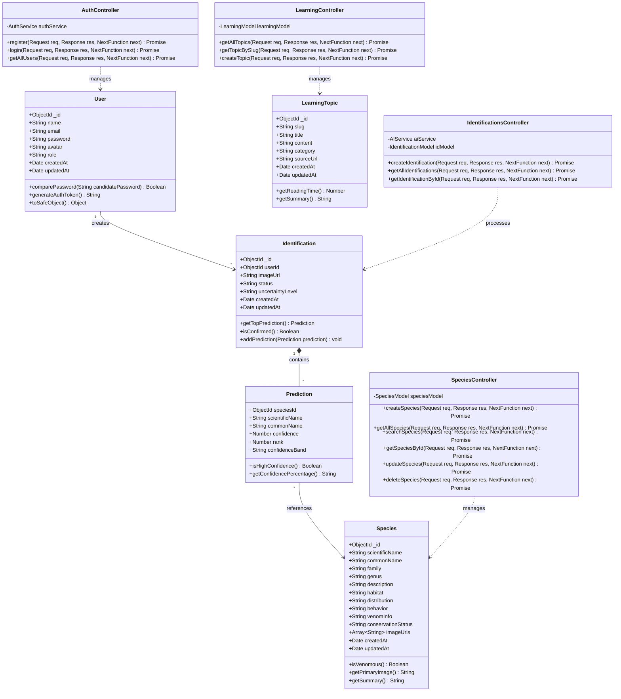

# redback.ai — Spider Explorer AI

redback.ai is a mobile-first AI application for identifying spider species from photographs and presenting reliable scientific and educational information about the identified species.

## Documentation

- **PRD (Product Requirements):** [`docs/01-PRD.md`](docs/01-PRD.md)
- **System Architecture & Stack:** [`docs/02-ARCHITECTURE.md`](docs/02-ARCHITECTURE.md)
- **API Specifications & Endpoints:** [`docs/03-API-SPECS.md`](docs/03-API-SPECS.md)
- **Mobile Screen Map (Expo Router):** [`docs/04-SCREEN-MAP.md`](docs/04-SCREEN-MAP.md)

## Current product scope

The current Redback screen list contains 13 screens:
1. Splash
2. Onboarding
3. Login
4. Register
5. Home
6. Camera Scanner
7. Upload Image
8. AI Results
9. Species Details
10. Search
11. Learning Center
12. User Profile
13. Settings

Notification, quiz, favorite, and standalone learning-module features were removed from the earlier class-diagram scope. Learning content remains represented by the Learning Center screen and can be powered through the AI/API approach.

## System Architecture & Class Diagram

The core architecture follows the MVC pattern separating Mongoose domain models from API controllers:

## Suggested stack

- Mobile: React Native + Expo + Expo Router
- Backend: Express.js (TypeScript) + MongoDB (Mongoose)
- Auth: JWT + bcrypt/argon2-equivalent password hashing
- AI integration: external vision-capable AI API, abstracted behind the backend
- Scientific/search data: curated database plus external/open biodiversity sources where licensing and reliability permit
- Storage: object storage for uploaded images
- Optional async jobs: Redis + BullMQ

## Principles

1. AI predictions are probabilistic, not absolute.
2. Venom/toxicity information must be presented conservatively and with source attribution.
3. Scientific names and taxonomy should be traceable to authoritative sources.
4. User images are private by default.
5. API keys and model credentials never live in the mobile client.
